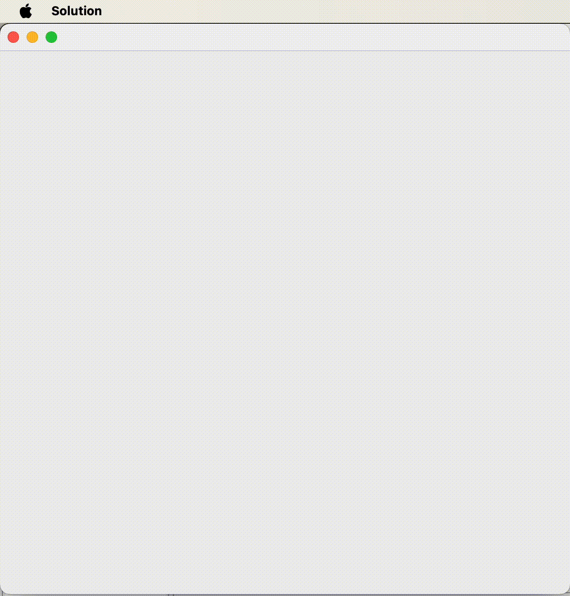

# T-shape cube puzzle solver.

A fun project that solves a puzzle where you have to fill a 6x6x6 cube with T-Block pieces (Tetris-like "T" shapes).

T-Block is a tetromino shaped like the "T" letter.

Pseudocode-ish:
```while explorationFrontier is not empty:
    map = explorationFrontier.popLast()
    firstEmptyPosition = map.findEmptyPosition()
    for each piece in pieces:
        piecesToFill = piece.getAllAbsolutePlacementsToFill(map, firstEmptyPosition)
        for each pieceToFill in piecesToFill:
            newMap = map.duplicate()
            newMap.placePieces(pieceToFill)
            if exploredMapsHashesSet contains newMap.hashCodeSymmetric():
                // already explored map, go on.
            else if newMap is done:
                mapRenderer.render(newMap)
            else if newMap is doable with pieces:
                exploredMapsHashesSet.add(newMap.hashCodeSymmetric())
                explorationFrontier.add(newMap)

```

The main code is [here](src/com/bogdan/PuzzleSolver.java#L27). 


test
test

test
test
test
test
test
test